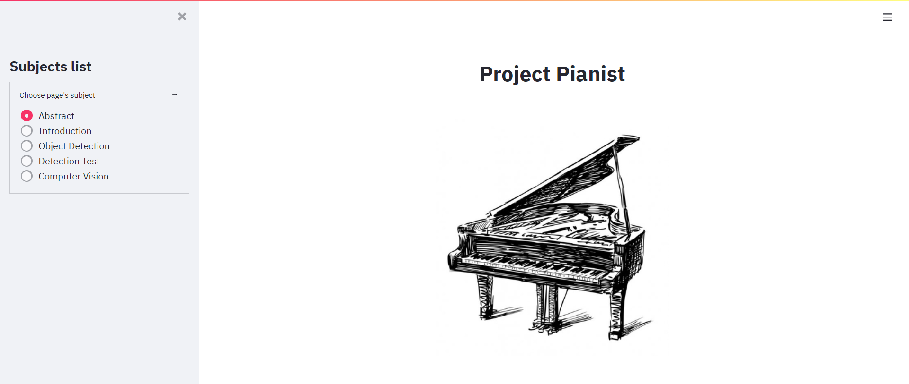

<p align="center"></p>
<div align="center"><h1>Pianist Desktop</h1></div>

---

## 1. Usage
* **Option.py**
```python
# path : PianistDesktop/packages/option.py

class Option:
    def __init__(self):
        self.__dict__['weights'] = 'models/best.pt'
        # Please put in the image you want to convert.
        self.__dict__['source'] = 'models/data/images'
        self.__dict__['img_size'] = 2048
        self.__dict__['conf_thres'] = 0.8
        self.__dict__['iou_thres'] = 0.5
        self.__dict__['device'] = ''
        self.__dict__['view_img'] = False
        self.__dict__['save_txt'] = True
        self.__dict__['save_conf'] = True
        self.__dict__['save_crop'] = True
        self.__dict__['nosave'] = False
        self.__dict__['classes'] = None
        self.__dict__['agnostic_nms'] = False
        self.__dict__['augment'] = False
        self.__dict__['update'] = False
        # Converted results are stored /run/detect/exp{n}
        self.__dict__['project'] = '/runs/detect'
        self.__dict__['name'] = 'exp'
        self.__dict__['exist_ok'] = False
        self.__dict__['line_thickness'] = 1
        self.__dict__['hide_labels'] = False
        self.__dict__['hide_conf'] = False
```

* **Converted files**
```angular2html
exp{n} ------ labels ---- text files
        |
        |---- image files
```

* **Note**
```python
# first, put the path of converted files

# path : Pianist/utils/score.py
if __name__ == '__main__':
    # Please put the path of the converted images
    image_path = ""
    # Please put the path of the converted labels
    label_path = ""
    ...

# and then, check folder notes

# path : Pianist/result/notes.txt
```

---

## 2. Reference

* **DeepScore :**
  https://tuggeluk.github.io/
* **Pytorch-Yolo v5 :**
  https://github.com/ultralytics/yolov5
* **Roboflow :**
  https://roboflow.com/

---

## 3. Environments

* **Hardware Environment**
```
CPU : 48 vCPU
GPU : NVIDIA Tesla A100 x 4
RAM : 340GB memory
Disk : 20GB balanced persistent disk
OS : Ubuntu 18.04 LTS
Pytorch : 1.8.1 version
CUDA: 11.1 version
```
* **Requirements**
```bash
pip install -r requirements.txt
```

* **Review**
<p align="center"></p>

---

## 4. Streamlit

```bash
streamlit run main.py
```

---

## 5. VR Content Download

* **Google Drive URL :**
https://drive.google.com/drive/folders/12N9wUYfFP8Lm0WtIN58A-DIdeR_WiPrm?usp=sharing